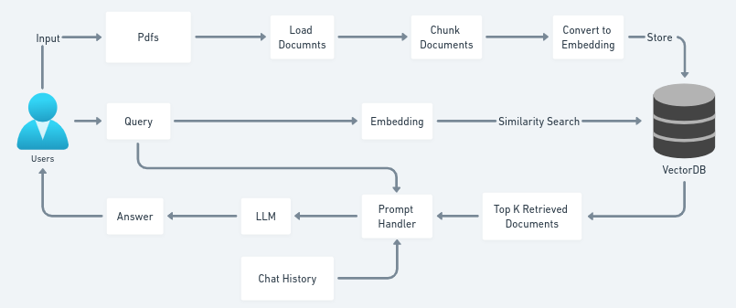

# Chat with Multiple PDFS using GenAI

## How to run?
### STEPS:

### STEP 01- Clone the repository
```
git clone https://github.com/Sumegh20/Chat-with-Multiple-PDFS-using-GenAI.git
```
### STEP 02- Create virtual environment & Install requirements
```
bash init_setup.sh
```
### STEP 03- Create a .env file in the root directory and add your GOOGLE_API_KEY & GROQ_API_KEY credentials as follows:
```
GOOGLE_API_KEY = "***************************"
GROQ_API_KEY = "***************************"
```

[Create google API Key](https://ai.google.dev/gemini-api/docs/api-key)

[Create groq API Key](https://console.groq.com/docs/quickstart#create-an-api-key)

### STEP 04- Activate the virtual environment
```
conda activate pdf_env/
```
### STEP 05- Finally run the following command
```
streamlit run app.py
```

### STEP 06- Open up localhost
```
http://localhost:8501/
```

## Code Architecture


## Techstack Used:
- Python
- LangChain
- Streamlit
- groq
- Gemma-7b-It
- FAISS